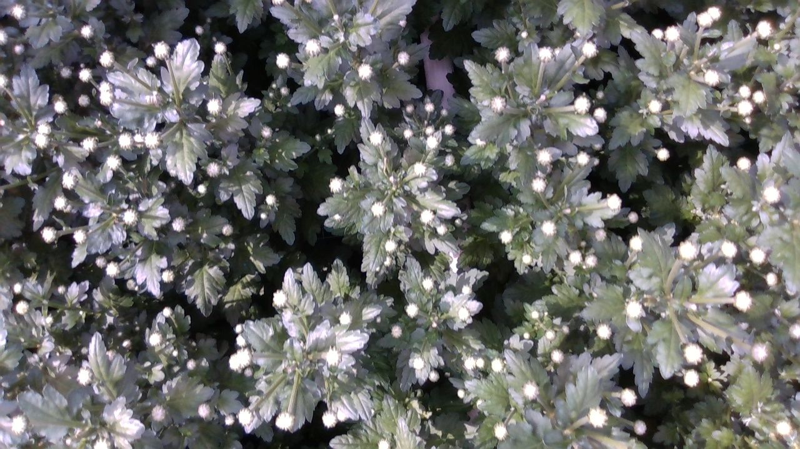
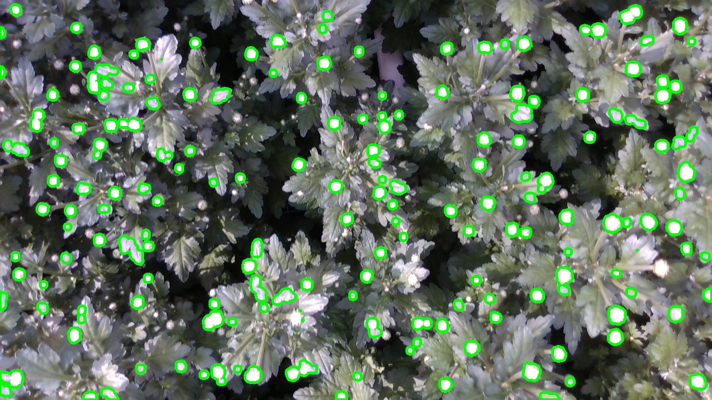

# Flower Buds Segmentation

This repository contains code for segmenting flower buds from an input image using computer vision techniques. It utilizes the OpenCV library and Python.

The main functionalities provided by this code are:
- Preprocessing the input image by adjusting brightness, contrast, and applying thresholding.
- Detecting and extracting flower bud contours.
- Drawing the detected contours on the image and saving the result.
- Calculating contour statistics such as area and center coordinates.
- Saving the contour statistics in a CSV file.

## How to Run

### Setup

1. Clone this repository:
   ```bash
   git clone https://github.com/your-username/flower-buds-segmentation.git
   cd flower-buds-segmentation
   ```

2. Install the required dependencies:
   ```bash
   pip install -r requirements.txt
   ```

### Usage

To run the code, you have two options: running it locally or using Docker.

#### Running Locally

1. Make sure you have Python 3.8 or higher installed.

2. Run the main script with the required command-line arguments:

    ```bash
    python -m src.main input_image.jpg output_image.jpg output_stats.csv
    ```

Replace `input_image.jpg` with the path to your input image file, `output_image.jpg` with the desired path for the output image file, and `output_stats.csv` with the desired path for the output CSV file.

3. The output image and CSV file will be generated based on the provided paths.

## Running with Docker

1. Install Docker on your machine by following the [official Docker documentation](https://docs.docker.com/get-docker/).

2. Build the Docker image using the provided Dockerfile:

    ```bash
    docker build -t flower-buds-segmentation .
    ```
3. Run the Docker container:

    ```bash
    docker run --rm -v /path/to/your/images:/app/images flower-buds-segmentation python -m src.main /app/images/input_image.jpg /app/images/output_image.jpg /app/images/output_stats.csv
    ```


Replace `/path/to/your/images` with the path to the directory containing your input image file. Make sure to provide the correct paths for the input image, output image, and output CSV file.

4. The output image and CSV file will be generated in the specified directory.


### Examples

You can find example input images and their corresponding outputs in the `examples` directory.

**Input Image Example:**



**Output Image Example:**




## Running Tests

To run the tests for this project, you can use `pytest`. Navigate to the root directory of the project and run

```bash
    pytest
```

